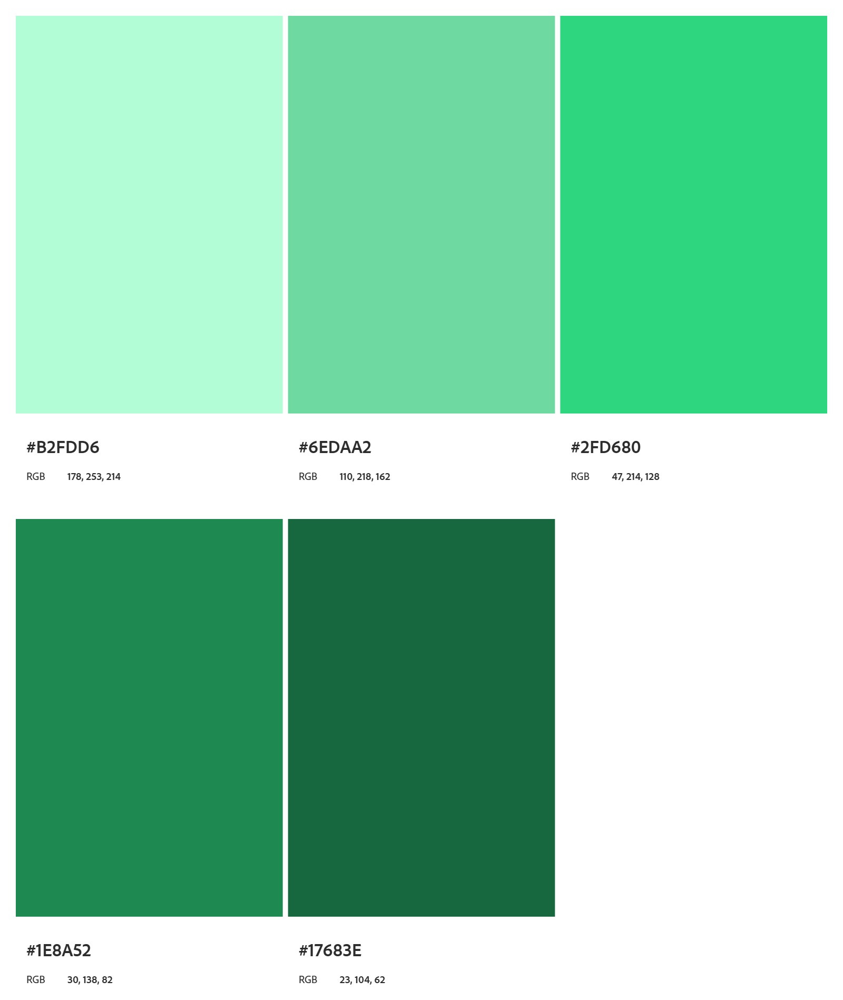

#  Projeto Android
🗒️ O projeto Android é site simples desenvolvido para compartilhar informações interessantes sobre o mascote oficial do Android, conhecido como **Bugdroid**.

Projeto desenvolvido durante o <a href="https://www.cursoemvideo.com/curso/html5-css3-modulo1/" target="_blank">**curso de HTML5 e CSS3**</a> oferecido pelo <a href="https://www.cursoemvideo.com/" target="_blank">**CursoemVídeo**</a>

🔗<a href="https://artursantez.github.io/projeto-android/" target="_blank"> **Clique aqui para acessar o site**</a>

## ✨ Sobre o Projeto
O mascote do Android é mais do que apenas um ícone, ele representa a essência do sistema operacional que conecta bilhões de dispositivos ao redor do mundo. Neste site, você encontrará:

- Um resumo da origem do mascote e como ele foi criado;
- Fatos curiosos e divertidos sobre o design e evolução do Bugdroid;
- Curiosidades sobre o sistema Android.

## 🛠️ Tecnologias Utilizadas
- **HTML5** para a estrutura da página;
- **CSS3** para estilização e design responsivo.
  
  
  
  

## 🎨 Composição Visual 
Os elementos visuais foram pensados para criar uma interface limpa e moderna, alinhada ao estilo minimalista característico do Android.
### Paleta de cores 
O design do site foi planejado para refletir a identidade visual do Android, com uma paleta de cores inspirada no mascote Bugdroid:

     

### Fontes
As fontes utilizadas no site foram escolhidas para garantir legibilidade e refletir o estilo moderno e tecnológico do Android:

- **Bebas Nue**: Usada como destaque no site, é uma fonte sans-serif com características marcantes, além de um design minimalista e moderno, reforçando o tema tecnológico do site.
- **Roboto**: Principal fonte do projeto, utilizada em todos os textos. Roboto é a fonte oficial do Android, conhecida por sua legibilidade e design limpo.
- **IDroid**: A fonte IDroid, usada nos títulos, possui um estilo único e futurista que se conecta diretamente ao tema de tecnologia. 

## 💡 Atualizações planejadas
Conforme eu aprenda novas tecnologias e conceitos, irei atualizar esse projeto com o intuito de: 
- Melhorar a responsividade para diferentes dispositivos;
- Adiciona animações e interatividade;
- Aprimorar a composição visual do site.

## 📝 Licença
Este projeto está licenciado sob a <a href="LICENSE">Licença MIT</a>.
